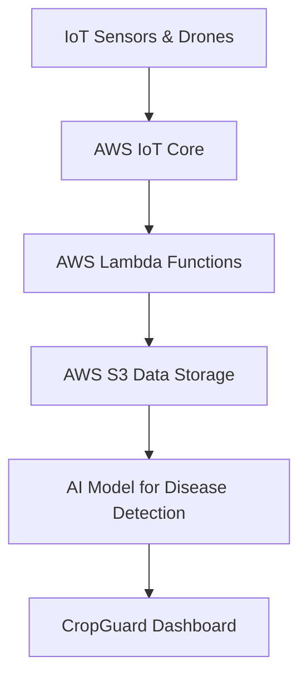

## 🌾 CropGuard AI

**AI-powered precision-farming assistant** that uses IoT and computer vision to monitor crop health, detect early diseases, and recommend preventive actions.

---

### 🚀 Overview

CropGuard AI is a smart agriculture solution developed for the **AWS AI Agent Global Hackathon 2025** on Devpost.
It integrates **AI models, IoT sensors, and AWS services** to give farmers real-time crop insights — empowering data-driven and sustainable farming.

---

### 🧠 Key Features

* 🌱 **Disease Detection:** AI analyzes leaf images to identify crop diseases early.
* 🪲 **Pest Monitoring:** IoT sensors detect abnormal pest activity.
* 🌦️ **Weather Forecasting:** Predicts local conditions for smarter irrigation and fertilizer planning.
* 📊 **Smart Dashboard:** Visual interface showing alerts and actionable tips.
* 🔄 **Scalable AWS Integration:** Uses AWS S3 for data, Lambda for automation, and Rekognition for image analysis.

---

### 🧰 Tech Stack

| Category            | Technologies                                         |
| ------------------- | ---------------------------------------------------- |
| **Frontend**        | HTML · CSS · JavaScript                              |
| **Backend / Cloud** | AWS Lambda · AWS S3 · AWS Rekognition · AWS IoT Core |
| **AI Modeling**     | Python · TensorFlow / OpenCV                         |
| **Other Tools**     | Figma · Canva · GitHub · Devpost                     |

---

### 🧩 Architecture Flow



---

### 🖥️ Getting Started

#### 1️⃣ Clone the Repository

```bash
git clone https://github.com/Shrenimasingh/CropGuardAI.git
cd CropGuardAI
```

#### 2️⃣ Run Locally

If prototype only:

> Open `index.html` in your browser

If Python backend:

```bash
pip install -r requirements.txt
python app.py
```


---

### 🌐 Live Demo / Prototype

🪴 [View Hackathon Submission on Devpost](https://devpost.com/submit-to/26338-aws-ai-agent-global-hackathon/manage/submissions/822055-cropguardai-ai-powered-crop-health-assistant/project_details/edit)

---


---

### ⚙️ Future Improvements

* Integrate real sensor data with AWS IoT Core.
* Expand AI model training to multi-crop datasets.
* Add mobile support for farmer field access.

---

---

### 📫 Contact

📧 mohisingh008@gmail.com  |  🌐 (https://www.linkedin.com/in/shrenima-singh-2b6603332/)  |  🧾(https://cropguardai.my.canva.site/)
